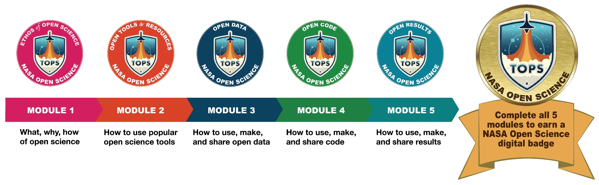

# Open Science Trainings

## Navigation
- [Open Science 101](#open-science-101)
- [Science Core](#sciencecore)
- [Open Science Essentials](#open-science-essentials)

## Open Science 101

Discover all **5 modules** from the Open Science 101 curriculum by [visiting our website](https://science.nasa.gov/open-science/tops/os101).

### Earn Your Digital Badge

To get badged for Open Science 101, explore options for self guided enrollment and instructor led trainings [on our website](https://nasa.github.io/Transform-to-Open-Science/take-os101/).

### Cite Open Science 101

Are you a researcher looking to cite our curriculum?  The following DOI information will allow you to cite the current version:

**NASA TOPS Open Science 101 Curriculum Development Team. (2023). NASA TOPS Open Science 101 version 1.0.0. Zenodo. DOI: 10.5281/zenodo.10161527.**

### Help Improve Open Science 101

TOPS has created a development version of the curriculum written in Markdown to enable the community to help make it even better.  It can be found [here](https://github.com/nasa/Transform-to-Open-Science/tree/open-science-101).

**Note:** The GitHub version of the curriculum will not allow  you to get credit for taking the curriculum.  To get badged for Open Science 101 [sign up here](https://nasa.github.io/Transform-to-Open-Science/take-os101/).

#### Methods of Contributing

To contribute, you can open a [pull request](https://github.com/nasa/Transform-to-Open-Science/pulls), [issue](https://github.com/nasa/Transform-to-Open-Science/issues), or [discussion](https://github.com/nasa/Transform-to-Open-Science/discussions). 

For technical details on contributing to Open Science 101, please visit our [contributing page](./CONTRIBUTING.md#contributing-to-open-science-101-on-github).

### Teach Open Science 101

#### New Instructors

To become an instructor for Open Science 101, [contact TOPS](mailto:hq-openscience@nasa.gov) to find out more about this process.  More details will be posted soon.

#### Existing Instructors

Are you already teaching OS101?  Learn how you can get your instructor-led training listed on our website by reading our [workshop listing requirements](./docs/Area2_Capacity_Sharing/Open-Science-101/workshop_listings.md).

## ScienceCore

The Open Science 101 curriculum will be expanded to support researchers looking to engage with NASA as NASA moves to adopt more open science requirements (*e.g.*, [Scientific Information Policy](https://science.nasa.gov/researchers/science-data/science-information-policy) and [ROSES](https://science.nasa.gov/researchers/sara/grant-solicitations) opportunities). In addition to the skills obtained from Open Science 101, scientists will need to grow skills specific to their area of study. Potential ScienceCore topics are data science, using cloud computing resources, how to share biological samples, how to utilize MakerSpaces or shared labs, etc.

**TOPS is still developing the plan and incentive structure for the ScienceCore. If you have any ideas, utilize GitHub discussions and share them with us!**

### Module Descriptions

The design calls for several, individual 2.5-hour modules that focus on data science skills and domain-specific open science practices that could be taught in-person during large society meetings or during science team meetings, completed individually online, or completed via group-organized online events. 
* Each course module will be a 2.5-hour interactive learning experience with slides, videos, quizzes, and activities.
* All content will be assigned a CC0 or CC-BY license.

## Open Science Essentials

Open Science essentials will be a condensed course based on Open Science 101 that is designed for managers to become familiar with the principles of Open Science so that they can implement Open Science practices in the work place, and in employee trainings.  More information will be posted here as development is completed.