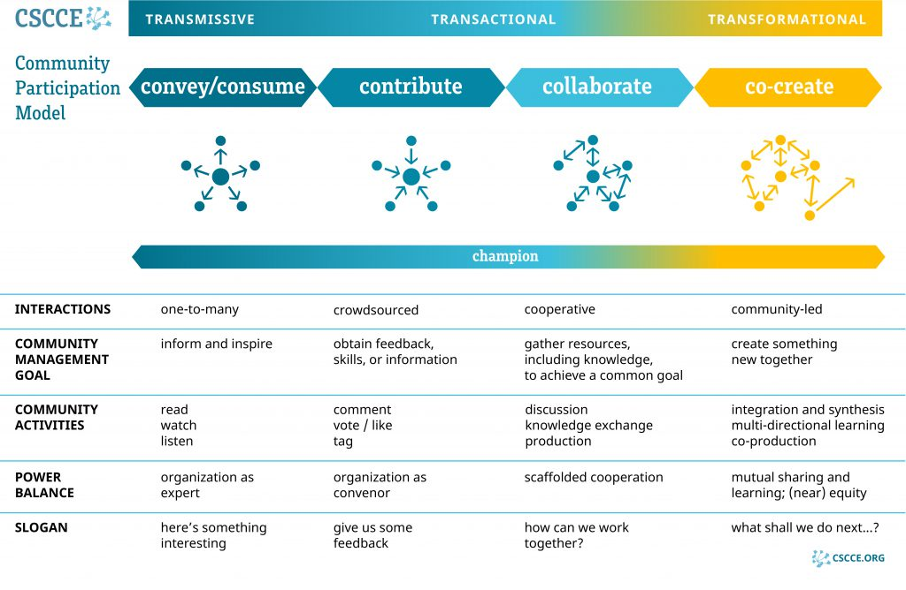

# Community Participation Model 
To reach the broadest of communities, our TOPS team seeks to form equitable partnerships with academic institutions, non-profits, professional societies, and other government agencies. When working with others to build a vibrant equitable community, we define our goals and objectives for groups of community partners, focusing on the roles the community partners serve and potential ways we can collaborate. We co-create thoughtful calls of action and together develop a shared understanding and determine appropriate collaborations that will benefit all parties. 

|  |
|:--:|
| <b>Image courtesy of The Center for Scientific Collaboration and Community Engagement via [https://www.cscce.org/resources/cpm/](https://www.cscce.org/resources/cpm/)</b>|

Here are some ways we collaborate and communicate with communities:

 - [Host community forums](/docs/Area1_Engagement/Community_Forums/readme.md)

 - Participate in webinars at community meetings

 - [Co-develop open science curricula](/docs/Area2_Capacity_Sharing/OpenCore/readme.md)

 - Co-create a [forum](https://github.com/nasa/Transform-to-Open-Science/discussions) with diverse voices/perspectives

 - Co-create articles of success

 - Develop podcast with the Geoscience and Remote Sensing Society (GRSS), a technical society of the Institute of Electrical and Electronics Engineers (IEEE)

 - Collaborate with communities focused on historically underrepresented groups

 - Promote open science in [High Priority Publications](/docs/Area1_Engagement/Outreach/tops_publications.md), through a roadshow (virtual if necessary) to brief editorial boards of top science publications, publishing pieces in high priority publications - scientific and popular media forms, and write Op-eds in key publications

If your community is interested in working together, please contact us.
